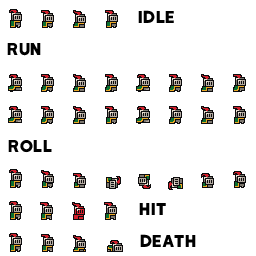

<a id="readme-top"></a>

<!-- SHIELDS -->
[![Contributors][contributors-shield]][contributors-url]
[![Forks][forks-shield]][forks-url]
[![Stargazers][stars-shield]][stars-url]
[![Issues][issues-shield]][issues-url]
[![MIT License][license-shield]][license-url]

<!-- HEADER -->
<br />
<div align="center">
	
	<h1 align="center">Enemy Hunter</h1>
	<p align="center">
		A 2D platformer game built with Godot Engine.<br />
		Hunt enemies, collect coins, and survive as long as you can!
	</p>
</div>

<!-- CONTENTS -->
<details>
	<summary>Table of Contents</summary>
	<ol>
		<li>
			<a href="#about">About The Project</a>
			<ul>
				<li><a href="#built-with">Built Using</a></li>
			</ul>
		</li>
		<li>
			<a href="#getting-started">Getting Started</a>
			<ul>
				<li><a href="#installation">Installation</a></li>
			</ul>
		</li>
		<li><a href="#usage">Usage</a></li>
		<li><a href="#license">License</a></li>
	</ol>
</details>


<!-- ABOUT -->
## About The Project

Enemy Hunter is a 2D platformer game where you play as a knight battling enemies and collecting coins. The goal is to defeat all enemies, avoid hazards, and reach the end of the level with as many coins and health as possible.

### Game Features
- Play as a knight character with smooth movement and jump mechanics
- Defeat green enemies by jumping on them twice
- Collect coins scattered throughout the level
- Avoid kill zones and damage zones to survive
- Health system: take damage from enemies and hazards
- Animated platforms and interactive environment
- Simple scoring system based on coins collected and enemies defeated

### Main Scenes & Scripts
- `Scenes/game.tscn`: Main game scene with player, enemies, coins, platforms, and UI labels
- `Scripts/player.gd`: Handles player movement, jumping, health, and damage
- `Scripts/green_enemy.gd`: Controls enemy movement, damage, and death
- `Scripts/game_manager.gd`: Manages score and coin collection

### Controls
- Move Left: `A` or Left Arrow
- Move Right: `D` or Right Arrow
- Jump: `Space`

### Objective
Jump on enemies twice to defeat them, collect coins, and reach the end of the level. Watch your health and avoid hazards!

<p align="right">(<a href="#readme-top">top</a>)</p>


### Built Using
This project was built using:
- [Godot Engine](https://godotengine.org/) (GDScript)

<p align="right">(<a href="#readme-top">top</a>)</p>

<!-- GETTING STARTED -->
## Getting Started

### Installation
1. Clone this repository:
	```sh
	git clone https://github.com/ryukgod26/godot2d-game.git
	```
2. Open the project in Godot Engine (version 4.x recommended)
3. Run the main scene (`game.tscn`) to start playing

<p align="right">(<a href="#readme-top">top</a>)</p>

<!-- USAGE -->
## Usage

1. Move your character using the arrow keys or A/D
2. Jump with Space
3. Jump on enemies twice to defeat them
4. Collect coins to increase your score
5. Avoid hazards and keep your health above zero

<p align="right">(<a href="#readme-top">top</a>)</p>

<!-- LICENSE -->
## License

Distributed under the MIT License. See `LICENSE` for more information.

<p align="right">(<a href="#readme-top">back to top</a>)</p>


<!-- URLS -->
[contributors-shield]: https://img.shields.io/github/contributors/budziot/Godot_Super-Wakatime?style=for-the-badge
[contributors-url]: https://github.com/BudzioT/Godot_Super-Wakatime/graphs/contributors
[forks-shield]: https://img.shields.io/github/forks/budziot/Godot_Super-Wakatime?style=for-the-badge
[forks-url]: https://github.com/BudzioT/Godot_Super-Wakatime/forks
[stars-shield]: https://img.shields.io/github/stars/budziot/Godot_Super-Wakatime?style=for-the-badge
[stars-url]: https://github.com/BudzioT/Godot_Super-Wakatime/stargazers
[issues-shield]: https://img.shields.io/github/issues/budziot/Godot_Super-Wakatime?style=for-the-badge
[issues-url]: https://github.com/BudzioT/Godot_Super-Wakatime/issues
[license-shield]: https://img.shields.io/github/license/budziot/Godot_Super-Wakatime?style=for-the-badge
[license-url]: https://github.com/BudzioT/Godot_Super-Wakatime/blob/master/addons/godot_super-wakatime/LICENSE
[product-screenshot]: https://cloud-j4wibbzz7-hack-club-bot.vercel.app/0image.png
[product-logo]: https://cloud-j4wibbzz7-hack-club-bot.vercel.app/2godotwaka2.png
[Godot]: https://img.shields.io/badge/Godot%20Engine-478CBF?logo=godotengine&logoColor=fff&style=flat
[Godot-url]: https://godotengine.org/
[Ouch-shield]: https://img.shields.io/badge/Ouch!-tool-blue?label=Ouch!
[Ouch-url]: https://github.com/ouch-org/ouch
[time-screenshot]: https://cloud-l88kldf50-hack-club-bot.vercel.app/0image.png
